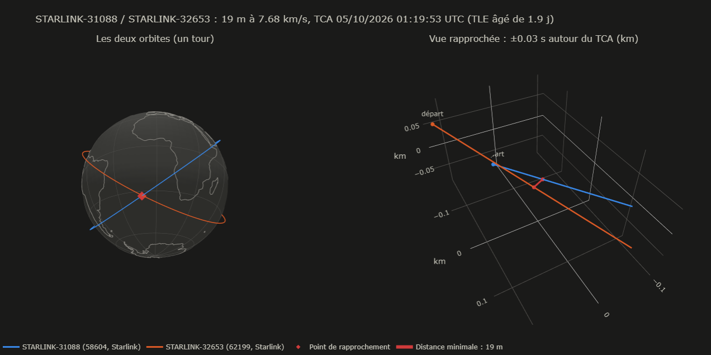

# Orbital Conjunctions

Outil Python qui repère, à partir de données publiques, les satellites et débris en orbite
basse qui vont passer près les uns des autres dans les 24 heures à venir. Il a été vérifié
sur deux collisions réelles, et il propose une analyse de la congestion orbitale : qui se
croise de près, et pourquoi.

## Le problème

Des dizaines de milliers d'objets suivis tournent en orbite basse (moins de 2 000 km
d'altitude) : des satellites en service, mais aussi des débris issus d'explosions ou de
collisions. Le catalogue utilisé ici en contient environ 17 800 (voir plus bas).
Ils se déplacent à environ 7,5 km/s. Deux objets qui se croisent le font souvent à plus de
10 km/s, et un choc détruit les deux en créant des milliers de nouveaux débris.

La question posée par ce projet : parmi les ~159 millions de paires d'objets possibles,
lesquelles vont passer à moins de 5 km l'une de l'autre dans les prochaines 24 heures ?

## Les données utilisées

TLE (Two-Line Elements). Le commandement spatial américain publie pour chaque objet un TLE :
deux lignes de texte qui décrivent son orbite à un instant donné (inclinaison, forme de
l'orbite, nombre de tours par jour, position sur l'orbite...). Un TLE n'est pas une position :
c'est une description de la trajectoire, à partir de laquelle on calcule la position à
n'importe quel instant. Les TLE sont téléchargés depuis CelesTrak (https://celestrak.org),
qui demande de ne pas re-télécharger les mêmes données plus d'une fois toutes les deux
heures : le programme garde donc une copie locale pendant 2 h.

Le catalogue utilisé contient les satellites actifs de CelesTrak et trois grands nuages de
débris : ceux du satellite chinois Fengyun 1C (détruit par un tir de missile en 2007), et
ceux de la collision entre Iridium 33 et Cosmos 2251 (2009). Seuls les objets dont toute
l'orbite est sous 2 000 km sont gardés, soit environ 17 800 objets.

SATCAT. Le catalogue des objets de CelesTrak (un fichier mis à jour chaque jour, gardé
24 h en cache) donne pour chaque objet son type (satellite, corps de fusée, débris), son
statut (en service ou non) et un code propriétaire. Attention : ce code est surtout un pays
(US, PRC, UK...). Starlink (SpaceX) et Kuiper (Amazon) y sont tous deux "US". Pour distinguer
les opérateurs, le programme reconnaît donc les grandes familles de satellites au début de
leur nom (STARLINK-1234, ONEWEB-0012, FLOCK 4H-19...), à partir d'une liste écrite à la main
de 21 familles. Environ 86 % des satellites actifs sont ainsi rattachés à une famille ; les
autres sont classés "non identifiés", avec leur pays.

TLE historiques. Pour rejouer des collisions passées, les TLE de l'époque sont téléchargés
depuis Space-Track.org, le site officiel qui les produit (compte gratuit nécessaire).

Côtes des continents. Pour les vues 3D, les contours viennent de la base libre Natural Earth.

## Comment fonctionne la détection

1. Calcul des positions. L'algorithme SGP4, utilisé avec les TLE depuis les années 1980,
transforme un TLE et une date en position et vitesse. Le programme calcule la position de
chaque objet toutes les 10 secondes pendant 24 heures, soit environ 154 millions de positions.
Le calcul est fait pour tous les objets à la fois (vectorisé avec numpy), et découpé en
tranches de 30 minutes pour ne pas saturer la mémoire.

2. Recherche des paires proches, en entonnoir. Comparer toutes les paires à chaque instant
serait beaucoup trop long. On procède en trois filtres successifs :

- À chaque instant, un KD-tree (une structure qui range les points de l'espace dans des boîtes
  imbriquées) trouve les paires à moins de 85 km, sans tester toutes les paires. Pourquoi 85 km
  et pas 5 ? Le moment exact du rapprochement tombe entre deux instants de la grille, au plus
  à 5 secondes de l'un d'eux. En 5 secondes, deux objets qui se croisent à 16 km/s (le maximum
  en orbite basse) s'éloignent de 80 km. Si deux objets passent à moins de 5 km, ils sont donc
  forcément à moins de 5 + 80 = 85 km à un instant de la grille : aucun rapprochement n'est raté.
- Sur quelques secondes, une trajectoire orbitale est presque une ligne droite (l'erreur est
  d'environ un mètre). Pour chaque paire trouvée, on calcule donc directement, en ligne droite,
  à quel moment et à quelle distance les deux objets seront au plus près. On ne garde que les
  paires qui passent à moins de 6 km.
- Pour les paires restantes, on recalcule avec SGP4 l'instant exact du rapprochement (appelé
  TCA) et la distance minimale, à la milliseconde près, avec une méthode de recherche de minimum
  (méthode de Brent).

Sur une journée type, l'entonnoir donne à peu près ceci :

    Toutes les paires possibles ..................... 159 000 000
    Paires à moins de 85 km à un instant (KD-tree) ...  3 700 000
    Paires à moins de 6 km (ligne droite) ...........     71 000
    Rapprochements à moins de 5 km (calcul exact) ...  50 000 à 60 000

Une même paire peut se croiser plusieurs fois dans la journée (une fois par tour d'orbite),
d'où plus de rapprochements que de paires. Les objets qui voyagent ensemble (modules amarrés
à une station spatiale, satellites en vol en formation) sont écartés : leur vitesse relative
est inférieure à 10 m/s, ce ne sont pas des croisements.

Vue d'ensemble produite par view.py : les objets du catalogue le 4 octobre 2026 à 19:01 UTC
(bleu : Starlink, orange : autres satellites, vert : débris), l'ISS, Hubble et la station
chinoise Tiangong avec leur orbite, et en rouge l'endroit où auront lieu les 20 prochains
rapprochements les plus proches. La page est interactive : on peut faire tourner le globe et
survoler un objet pour afficher son nom.

Détail d'un rapprochement (event.html) : deux satellites Starlink qui doivent passer à 19 m
l'un de l'autre, à 7,68 km/s, le 5 octobre 2026 à 01:19:53 UTC. À gauche, les deux orbites et
le point de rapprochement ; à droite, les trajectoires des deux satellites sur trois centièmes
de seconde autour de cet instant, avec en rouge la distance minimale. Comme toutes les distances
de l'outil, ces 19 m sont une valeur nominale, calculée avec des TLE précis à environ 1 km.

## Vérification sur deux collisions réelles

Le script backtest.py se place dans la situation de l'époque : il ne prend que les TLE publiés
avant chaque collision (3 jours, 2 jours, 1 jour et quelques heures avant), puis lance la même
détection que le programme principal.

    Collision                        Distance prévue    Instant prévu              Alerte < 5 km
    Iridium 33 / Cosmos 2251 (2009)  584 à 1 039 m      à 0,1 s de l'impact réel   oui, à chaque fois
    CERISE / débris d'Ariane (1996)  895 à 1 168 m      09:48:02 UTC               oui, à chaque fois

Pour la collision CERISE, l'heure réelle de l'impact n'est pas publiée : l'instant prévu ne
peut pas être vérifié.

Ce que ça montre :

- Le danger aurait été signalé dans les deux cas, dès trois jours avant.
- Avec les TLE de la veille, le programme prévoit 584 m pour Iridium / Cosmos, exactement la
  valeur publiée à l'époque par le système SOCRATES de CelesTrak, qui faisait le même travail.
  Deux calculs indépendants donnent le même résultat.
- La vraie distance était 0 m (il y a eu collision). L'écart de 0,6 à 1,2 km vient de
  l'imprécision des TLE, d'environ 1 km. C'est pourquoi le seuil d'alerte doit être large :
  avec un seuil de 1 km, l'alerte aurait été manquée deux jours avant.
- Seule la paire concernée a été rejouée : le test vérifie que le rapprochement aurait été
  détecté, pas qu'il aurait été jugé prioritaire. En 2009, SOCRATES l'avait bien signalé, mais
  au milieu de centaines d'autres rapprochements (64e en moyenne), et personne n'a réagi.

## Analyse de la congestion

Le script congestion.py relit la dernière détection et cherche à comprendre qui se croise.

Classement des rapprochements. Chaque rapprochement est rangé dans une catégorie, selon les
deux objets en présence :

- intra-constellation (congestion interne) : deux satellites actifs de la même famille, donc du
  même opérateur, qui gère seul ces croisements ;
- inter-opérateurs (exposition) : deux satellites actifs de familles différentes ;
- actifs, opérateur indéterminé : deux satellites non identifiés du même pays, dont on ne peut
  pas savoir s'ils appartiennent au même opérateur ;
- actif / objet inactif (pollution) : un satellite actif face à un débris, un corps de fusée
  ou un satellite hors service ;
- inactif / inactif (pollution) : deux objets qui ne sont plus en service.

Sur les deux journées analysées, 73 à 77 % des rapprochements ont lieu entre deux satellites
Starlink, 19 à 23 % entre opérateurs différents, et environ 4 % impliquent un débris.

Normalisation. Ces pourcentages bruts sont trompeurs : Starlink représente 70 % des satellites
actifs, il est donc normal qu'il soit présent dans la plupart des rapprochements. Pour savoir
si une catégorie est plus fréquente que prévu, le programme calcule un indice : la part observée
divisée par la part attendue si les objets se croisaient au hasard. Un indice de 1 veut dire
"autant que prévu", au-dessus de 1 "plus que prévu".

Le calcul est fait de deux façons. La version simple suppose que n'importe quelle paire d'objets
peut se croiser. La version corrigée ne compare que des objets présents à la même altitude
(par tranches de 100 km), car deux objets à 400 et 1 200 km ne se croiseront jamais. Les débris
ayant souvent des orbites allongées, chaque objet est compté dans chaque tranche au prorata du
temps qu'il y passe.

Résultat, pour la détection du 27 septembre 2026 : avec le calcul simple, les rapprochements
Starlink / Starlink semblent deux fois plus fréquents que prévu (indice 2,14) ; avec le calcul
corrigé de l'altitude, l'indice tombe à 0,98. Sur les deux journées analysées, les quatre
catégories principales ont un indice corrigé compris entre 0,9 et 1,3 (la petite catégorie
"opérateur indéterminé", moins d'une centaine de rapprochements, varie davantage : 1,1 puis
1,5). Autrement dit, la répartition des rapprochements
s'explique en grande partie par le nombre d'objets présents à chaque altitude, et non par une
catégorie d'acteurs en particulier. La raison est simple : plus de 90 % des rapprochements ont
lieu entre 400 et 500 km, l'altitude où volent la plupart des Starlink.

Densité. Pour chaque tranche d'altitude, le programme calcule le nombre d'objets par volume
d'espace, et le nombre de rapprochements subis en moyenne par chaque objet. La tranche 400-500 km
compte environ 173 objets par milliard de km3, 6 à 12 fois plus que les autres : chaque objet y
subit environ 11 rapprochements par jour, contre environ 1 ailleurs. Entre 300 et 1 000 km, le
nombre de rapprochements par objet augmente à peu près en proportion de la densité, comme pour
les molécules d'un gaz. C'est une observation sur une dizaine de tranches, pas une loi démontrée.

Matrice d'exposition. La page output/exposure.html montre, sous forme de tableau coloré, le
nombre de rapprochements entre chaque groupe d'opérateurs, avec une ligne pour les débris. Une
seconde vue divise ces nombres par le nombre de satellites de chaque opérateur. Sur la
détection du 27 septembre 2026, elle fait apparaître une asymétrie : chaque satellite de petites constellations qui volent à la même
altitude que Starlink (HawkEye 360, Jilin, Planet) croise en moyenne 5 à 9 Starlink par jour,
alors que chaque Starlink ne croise ces satellites que quelques centièmes de fois par jour.
Kuiper (Amazon), qui vole plus haut, vers 630 km, n'est presque pas exposé à Starlink.

Matrice d'exposition pour la détection du 4 octobre 2026, vue "rapprochements par jour" : chaque
case donne le nombre de rapprochements entre le groupe de la ligne et celui de la colonne. Les
cases grisées de la diagonale, avec leur valeur entre parenthèses, sont les rapprochements à
l'intérieur d'une même constellation, qui ne sont pas de l'exposition entre opérateurs. La
couleur suit une échelle logarithmique (chaque palier correspond à une multiplication par 10).

Historique. Chaque analyse est enregistrée dans output/history/ (une ligne par détection, plus
le détail par tranche d'altitude), avec une copie des rapprochements bruts pour pouvoir refaire
les calculs plus tard. Analyser deux fois la même détection remplace sa ligne au lieu de
l'ajouter. Chaque ligne garde les paramètres de calcul et un numéro de version de la méthode,
pour ne comparer que des analyses comparables. Entre le 27 septembre et le 4 octobre 2026, le
nombre de rapprochements Starlink / Starlink a baissé de 21 % alors que le nombre d'objets n'a
pas changé ; deux journées ne suffisent pas à dire s'il s'agit d'une fluctuation ou d'une
tendance.

Ce que cette analyse ne dit pas. Elle décrit qui se croise de près, pas qui est en danger. Un
indice proche de 1 ne prouve ni une bonne ni une mauvaise coordination entre opérateurs : les
manœuvres d'évitement prévues ne figurent pas dans les TLE publics. Enfin, le modèle "au hasard"
ignore l'inclinaison des orbites et la vitesse de croisement.

## Installation

Python 3.12 est recommandé.

    python -m venv .venv
    .venv\Scripts\activate          (sous macOS ou Linux : source .venv/bin/activate)
    pip install -r requirements.txt

## Utilisation

    python main.py          détection des rapprochements sur les 24 h à venir (environ 6 min)
    python congestion.py    analyse de la congestion de la dernière détection (environ 20 s)
    python view.py          vues 3D à jour de la dernière détection (quelques secondes)
    python backtest.py      vérification sur les collisions de 2009 et 1996 (quelques secondes)
    python demo.py          démonstration : un TLE décodé, la position actuelle de l'ISS...

Pour un historique cohérent, lancer congestion.py juste après main.py : l'analyse utilise le
catalogue du moment, qui doit être celui de la détection.

La détection est longue, mais il suffit de la relancer une ou deux fois par jour. view.py
recalcule ensuite les positions à l'instant présent en quelques secondes : il suffit de le
relancer puis de rafraîchir la page HTML.

Principales options (liste complète avec --help) :

    python main.py --threshold 1        seuil d'alerte de 1 km au lieu de 5
    python main.py --hours 12           prévision sur 12 h au lieu de 24
    python main.py --debris-only        n'afficher que les rapprochements impliquant un débris
    python main.py --csv fichier.csv    exporter les rapprochements affichés
    python view.py --debris-only        vues 3D limitées aux rapprochements impliquant un débris
    python view.py --event 3            détailler le 3e rapprochement à venir

backtest.py demande les identifiants Space-Track au premier lancement. Le mot de passe est
saisi sans s'afficher et n'est enregistré nulle part. Les données téléchargées restent dans
data/history/ : les conditions d'utilisation de Space-Track interdisent de les redistribuer.

Les résultats sont écrits dans le dossier output/ :

    last_run.csv / last_run.json    dernière détection (lue par view.py et congestion.py)
    overview.html                   vue 3D de tous les objets et des rapprochements à venir
    event.html                      détail d'un rapprochement
    exposure.html                   matrice d'exposition entre opérateurs
    history/                        historique des analyses de congestion

## Organisation du code

    main.py                    détection (programme principal)
    congestion.py              analyse de la congestion
    view.py                    vues 3D à partir de la dernière détection
    backtest.py                vérification sur des collisions réelles
    demo.py                    démonstration des briques de base
    conjunctions/
        fetch.py               téléchargements (TLE, SATCAT, côtes), avec copie locale
        catalog.py             lecture des TLE, liste des objets, filtre orbite basse
        propagate.py           SGP4, calcul vectorisé, conversion en latitude / longitude
        screening.py           détection en entonnoir (KD-tree, ligne droite, calcul exact)
        report.py              tableaux, export CSV, enregistrement des résultats
        visualize.py           vues 3D et matrice d'exposition (plotly)
        history.py             TLE historiques (Space-Track)
        metadata.py            type, statut, pays et famille de chaque objet (SATCAT)
        governance.py          classement des rapprochements, indices, matrice d'exposition
        altitude.py            temps de présence et densité par tranche d'altitude
        archive.py             historique des analyses
    docs/images/               captures d'écran utilisées dans ce README

## Limites

- Précision. Les TLE sont précis à environ 1 km au moment de la mesure, et l'erreur augmente de
  quelques km par jour. Les distances affichées sont des distances "nominales" : l'outil sert à
  repérer les rapprochements qui méritent une analyse plus fine, pas à calculer une probabilité
  de collision, qui demanderait de connaître l'incertitude de chaque position.
- Manœuvres. Un satellite qui allume ses moteurs rend son TLE faux jusqu'à la mesure suivante.
  Or les satellites Starlink, qui manœuvrent de façon autonome, sont impliqués dans la grande
  majorité des rapprochements détectés.
- Catalogue incomplet. Le catalogue ne contient ni les corps de fusée abandonnés, ni les
  satellites hors service, ni les débris autres que les trois nuages cités. La part réelle des
  rapprochements impliquant des débris est donc plus élevée que celle mesurée ici.
- Priorisation. Les rapprochements sont classés par distance, qui n'est pas un bon indicateur
  du danger réel (voir la vérification sur les collisions réelles).
- Identification des opérateurs. Elle repose sur le nom des satellites et sur une liste écrite à
  la main. Les satellites non identifiés sont regroupés par pays, pas par opérateur.

## Pistes non réalisées

Identifiées, puis écartées pour l'instant parce que leur coût dépassait leur intérêt :

- utiliser le catalogue complet de Space-Track, pour inclure les corps de fusée, les satellites
  hors service et tous les débris ;
- répartir la détection sur plusieurs cœurs du processeur : les instants de la grille sont
  indépendants, mais la détection ne tourne qu'une ou deux fois par jour ;
- afficher les positions en temps réel dans la page (petit serveur web local, ou calcul SGP4 dans
  le navigateur en JavaScript) : view.py en quelques secondes suffit ;
- animer le mouvement des objets : surtout décoratif, pour une page beaucoup plus lourde ;
- rejouer tout le catalogue de 2009, pour tester la priorisation et pas seulement la détection ;
- ajouter des intervalles de confiance aux indices, pour distinguer les vrais écarts du hasard.
