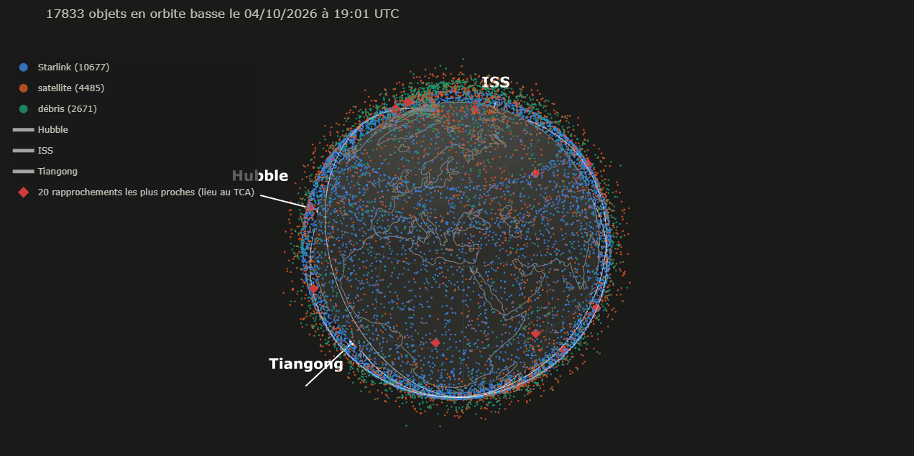
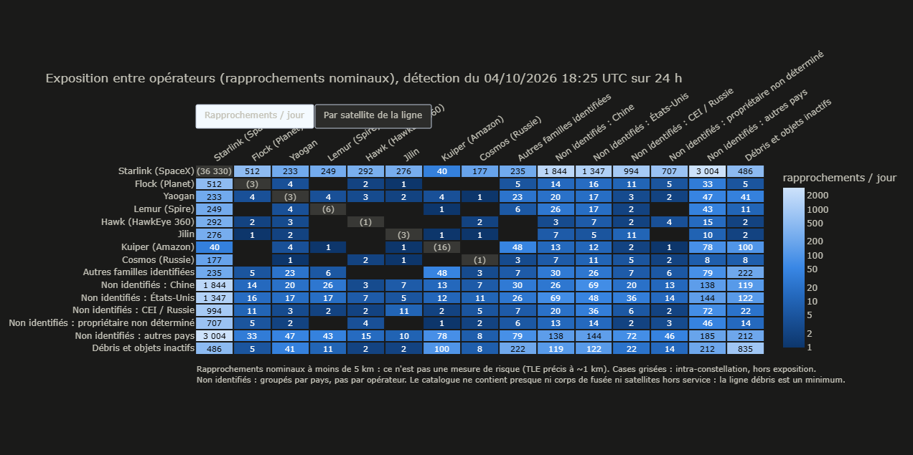

# Orbital Conjunctions

Cet outil Python qui repère les satellites et débris en orbite basse susceptibles passer près les uns des autres dans les 24 heures à venir, à partir de données publiques. Il a été rétro-testé
sur deux collisions réelles et permet une analyse de la congestion orbitale.

## Le problème

Des dizaines de milliers d'objets (satellites en service ou débris issus d'explosions/collisions) tournent en orbite basse (moins de 2 000 km
d'altitude). Le catalogue utilisé ici en contient environ 18 000. Ces objets se déplacent à environ 7,5 km/s ; une collision entre deux les détruirait en créant des milliers de nouveaux débris.

La question : parmi les (environ) 159 millions de paires d'objets possibles,
lesquelles vont passer proche l'une de l'autre ?

## Les données utilisées

Le commandement spatial américain publie pour chaque objet un TLE (Two-Line Elements),
deux lignes de texte qui décrivent son orbite (inclinaison, forme de
l'orbite, nombre de périodes par jour, position sur l'orbite...). Un TLE correspond à une description de la trajectoire, à partir de laquelle on calcule la position à
n'importe quel instant. On télécharge les TLE depuis CelesTrak (https://celestrak.org, le programme en garde une copie locale pendant 2 h).Le catalogue utilisé contient des satellites actifs et trois nuages de
débris, dont ceux du satellite chinois Fengyun 1C (détruit par un tir de missile en 2007), et
ceux de la collision entre Iridium 33 et Cosmos 2251 (2009). Seuls les objets dont
l'orbite est entièrement sous 2 000 km sont gardés.

Le programme utilise SATCAT, le catalogue des objets de CelesTrak (un fichier mis à jour chaque jour, gardé 24 h en cache), qui donne pour chaque objet son type (satellite, corps de fusée, débris), son statut (en/hors service) et un code propriétaire (correspondant surtout à un pays). Pour distinguer les opérateurs, le programme reconnaît les grandes familles de satellites au début de leur nom (ex : STARLINK-1234, ONEWEB-0012), à partir d'une liste écrite à la main
de 21 familles. Environ 86 % des satellites actifs sont rattachés à une famille ; les
autres sont classés "non identifiés", avec leur pays.

Pour la rétro-validation, on utilise aussi les TLE historiques (téléchargés depuis Space-Track.org).

## Comment fonctionne la détection

1) L'algorithme SGP4 est utilisé pour calculer les positions avec les TLE depuis les années 1980 (il transforme un TLE et une date en position et vitesse). Le programme calcule la position de
chaque objet toutes les 10 secondes pendant 24 heures. Le calcul est fait pour tous les objets à la fois et découpé en tranches de 30 minutes pour ne pas saturer la mémoire.

2) Ensuite vient la recherche des paires proches, en entonnoir. Comparer toutes les paires à chaque instant serait beaucoup trop long, donc on utilise trois filtres successifs :

- À chaque instant, un KD-tree (une structure qui range les points de l'espace dans des boîtes
  imbriquées) trouve les paires à moins de 85 km. En effet le moment exact du rapprochement tombe entre deux instants de la grille donc au plus à 5 secondes de l'un d'eux. En 5 secondes, deux objets se croisant à 16 km/s (le maximum en orbite basse) s'éloignent de 80 km. Si deux objets passent à moins de 5 km, ils sont donc forcément à moins de 85 km à un instant de la grille. Ainsi aucun rapprochement n'est raté.
- Sur quelques secondes, une trajectoire orbitale est presque une ligne droite (l'erreur est
  d'environ un mètre). Pour chaque paire trouvée, on calcule donc en ligne droite à quel moment et à quelle distance les deux objets seront au plus près. On ne garde que les paires qui passent à moins de 6 km.
- Pour les paires restantes, on recalcule avec SGP4 l'instant exact du rapprochement (TCA) et la   distance minimale avec une méthode de recherche de minimum (méthode de Brent).

Sur une journée type, on obtient à peu près ceci :

    Toutes les paires possibles ..................... 159 000 000
    Paires à moins de 85 km à un instant (KD-tree) ...  3 700 000
    Paires à moins de 6 km (ligne droite) ...........     71 000
    Rapprochements à moins de 5 km (calcul exact) ...  50 000 à 60 000

Une même paire peut se croiser plusieurs fois dans la journée. Les objets qui voyagent ensemble (modules amarrés à une station spatiale, satellites en vol en formation) sont écartés : leur vitesse relative est inférieure à 10 m/s, ce ne sont pas des croisements.

## Vérification sur deux collisions réelles

Le script backtest.py ne prend que les TLE publiés avant chaque collision (3 jours, 2 jours, 1 jour et quelques heures avant) puis lance la même détection que le programme principal :

    Collision                        Distance prévue    Instant prévu              Alerte < 5 km
    Iridium 33 / Cosmos 2251 (2009)  584 à 1 039 m      à 0,1 s de l'impact réel   oui, à chaque fois
    CERISE / débris d'Ariane (1996)  895 à 1 168 m      09:48:02 UTC               oui, à chaque fois

Pour la collision CERISE, l'horaire réel de l'impact n'est pas public.
Ce que ça montre :

- Le danger aurait été signalé dans les deux cas et dès trois jours avant
- Avec les TLE de la veille, le programme prévoit 584 m pour Iridium / Cosmos, exactement la
  valeur publiée à l'époque par le système SOCRATES de CelesTrak
- L'écart de 0,6 à 1,2 km vient de l'imprécision des TLE d'environ 1 km. C'est pourquoi le seuil d'alerte doit être large (avec un seuil de 1 km, l'alerte aurait été manquée deux jours avant)
- Seule la paire concernée a été rétro-testée ; le test vérifie que le rapprochement aurait été
  détecté, mais pas qu'il aurait été jugé prioritaire. En 2009, SOCRATES l'avait bien signalé, mais
  au milieu de centaines d'autres rapprochements (64e en moyenne).

## Analyse de la congestion

Le script congestion.py relit la dernière détection et cherche à comprendre qui se croise. Chaque rapprochement est classé par catégorie selon les deux objets en présence :

- intra-constellation (congestion interne) : deux satellites actifs dumême opérateur ;
- inter-opérateurs (exposition) : deux satellites actifs d'opérateurs différents ;
- actifs, opérateur indéterminé : deux satellites non identifiés du même pays, dont on ne peut
  pas savoir s'ils appartiennent au même opérateur ;
- actif / objet inactif (pollution) : un satellite actif face à un débris, un corps de fusée
  ou un satellite hors service ;
- inactif / inactif (pollution) : deux objets hors-service

Sur deux journées analysées, 73 à 77 % des rapprochements ont lieu entre deux satellites
Starlink, 19 à 23 % ont lieu entre opérateurs différents, et environ 4 % impliquent un débris.

Cependant, ces pourcentages bruts sont trompeurs. Starlink représente nen effet 70 % des satellites
actifs et il est donc normal qu'il soit impliqué dans la plupart des rapprochements. Pour savoir
si une catégorie est plus fréquente que prévu, le programme calcule un indice : le rapport entre la part observée et la part attendue si les objets se croisaient au hasard. Le calcul est réalisé de deux façons. La version simple suppose que n'importe quelle paire d'objets peut se croiser. La version "corrigée" ne compare que des objets présents à la même altitude,par tranches de 100 km. Les débris ayant souvent des orbites allongées, chaque objet est compté dans chaque tranche au prorata du temps qu'il y passe.

Pour la détection du 27 septembre 2026, avec le calcul simple, les rapprochements
Starlink / Starlink semblent deux fois plus fréquents que prévu (indice 2,14). Mais avec le calcul
corrigé de l'altitude, l'indice tombe à 0,98. Sur deux journées analysées, les quatre
catégories principales ont un indice corrigé compris entre 0,9 et 1,3 (la petite catégorie
"opérateur indéterminé", comptant moins d'une centaine de rapprochements, varie le plus : 1,1 puis
1,5). Cela signifie que la répartition des rapprochements s'explique en grande partie par le nombre d'objets présents à chaque altitude, plutôt que par une
catégorie d'acteurs en particulier. Pour chaque tranche d'altitude, le programme compare la densité d'objets et le nombre de rapprochements subis en moyenne par chaque objet. Le nombre de rapprochements par objet augmente à peu près en proportion de la densité, comme pour
les molécules d'un gaz.

La page output/exposure.html établit la matrice d'exposition. Elle montre le
nombre de rapprochements entre chaque groupe d'opérateurs. Une
seconde vue divise ces nombres par le nombre de satellites de chaque opérateur. Sur la
détection du 27 septembre 2026, elle montre une asymétrie : chaque satellite de petites constellations qui volent à la même
altitude que Starlink (HawkEye 360, Jilin, Planet) croise en moyenne 5 à 9 Starlink par jour,
alors que chaque Starlink ne croise ces satellites que quelques centièmes de fois par jour.
Kuiper (Amazon), qui vole plus haut (vers 630 km) n'est presque pas exposé à Starlink.

Ci-dessous la matrice d'exposition pour la détection du 4 octobre 2026 :

Chaque analyse est enregistrée dans output/history/ (une ligne par détection, plus
le détail par tranche d'altitude), avec une copie des rapprochements bruts pour pouvoir refaire
les calculs plus tard. Analyser deux fois la même détection remplace sa ligne au lieu de
l'ajouter. Chaque ligne garde les paramètres de calcul et un numéro de version de la méthode,
pour ne comparer que des analyses comparables. Entre le 27 septembre et le 4 octobre 2026, le
nombre de rapprochements Starlink / Starlink a baissé de 21 % alors que le nombre d'objets n'a
pas changé ; deux journées ne suffisent pas à dire s'il s'agit d'une fluctuation ou d'une
tendance.

## Installation

    python -m venv .venv
    .venv\Scripts\activate          (sous macOS ou Linux : source .venv/bin/activate)
    pip install -r requirements.txt

## Utilisation

    python main.py          détecte les rapprochements sur les 24 h à venir
    python congestion.py    analyse de la congestion de la dernière détection
    python view.py          vues 3D à jour de la dernière détection
    python backtest.py      vérification sur les collisions de 2009 et 1996

La détection est longue, mais il suffit de la relancer une ou deux fois par jour. view.py
recalcule ensuite les positions à l'instant présent en quelques secondes (il suffit de le
relancer puis de rafraîchir la page HTML).

Principales options (liste complète avec --help) :

    python main.py --threshold 1        seuil d'alerte de 1 km au lieu de 5
    python main.py --hours 12           prévision sur 12 h au lieu de 24
    python main.py --debris-only        n'afficher que les rapprochements impliquant un débris
    python main.py --csv fichier.csv    exporter les rapprochements affichés
    python view.py --debris-only        vues 3D limitées aux rapprochements impliquant un débris
    python view.py --event 3            détailler le 3e rapprochement à venir

backtest.py demande les identifiants Space-Track au premier lancement.

Les résultats sont écrits dans le dossier output/ :

    last_run.csv / last_run.json    dernière détection (lue par view.py et congestion.py)
    overview.html                   vue 3D de tous les objets et des rapprochements à venir
    event.html                      détail d'un rapprochement
    exposure.html                   matrice d'exposition entre opérateurs
    history/                        historique des analyses de congestion

## Organisation du code

    main.py                    détection (programme principal)
    congestion.py              analyse de la congestion
    view.py                    vues 3D à partir de la dernière détection
    backtest.py                vérification sur des collisions réelles
    demo.py                    démonstration des briques de base
    conjunctions/
        fetch.py               téléchargements (TLE, SATCAT, côtes), avec copie locale
        catalog.py             lecture des TLE, liste des objets, filtre orbite basse
        propagate.py           SGP4, calcul vectorisé, conversion en latitude / longitude
        screening.py           détection en entonnoir (KD-tree, ligne droite, calcul exact)
        report.py              tableaux, export CSV, enregistrement des résultats
        visualize.py           vues 3D et matrice d'exposition (plotly)
        history.py             TLE historiques (Space-Track)
        metadata.py            type, statut, pays et famille de chaque objet (SATCAT)
        governance.py          classement des rapprochements, indices, matrice d'exposition
        altitude.py            temps de présence et densité par tranche d'altitude
        archive.py             historique des analyses
    docs/images/               captures d'écran utilisées dans ce README

## Limites

- Précision : les TLE sont précis à environ 1 km au moment de la mesure et l'erreur augmente de
  quelques km par jour
- Manœuvres : un satellite qui allume ses moteurs rend son TLE faux jusqu'à la mesure suivante.
  Or les satellites Starlink, qui manœuvrent de façon autonome, sont impliqués dans la grande
  majorité des rapprochements détectés
- Incomplétude du catalogue : il ne contient ni les corps de fusée abandonnés, ni les
  satellites hors service, ni les débris autres que les trois nuages cités. La part réelle des
  rapprochements impliquant des débris est donc plus élevée que celle mesurée ici
- Priorisation : les rapprochements sont classés par distance, qui n'est pas un bon indicateur
  du danger réel
- Identification des opérateurs : elle repose sur le nom des satellites et sur une liste écrite à
  la main. Les satellites non identifiés sont regroupés par pays, pas par opérateur

## Pistes non réalisées

Voici les pistes identifiées puis écartées pour l'instant car leur coût dépassait leur intérêt :

- utiliser le catalogue complet de Space-Track
- répartir la détection sur plusieurs cœurs du processeur
- afficher les positions en temps réel
- animer le mouvement des objets
- rejouer tout le catalogue de 2009 pour tester la priorisation
- ajouter des intervalles de confiance aux indices pour distinguer les vrais écarts du hasard

## Conclusion

En orbite basse, la congestion visible dans les données publiques s'explique davantage par la densité d'objets à chaque altitude (dominée par Starlink entre 400 et 500 km) plutôt que par le comportement des acteurs. Les principaux enjeux de gouvernance sont ainsi la capacité des couches orbitales et le coût des débris supporté par d'autres que leurs responsables.
